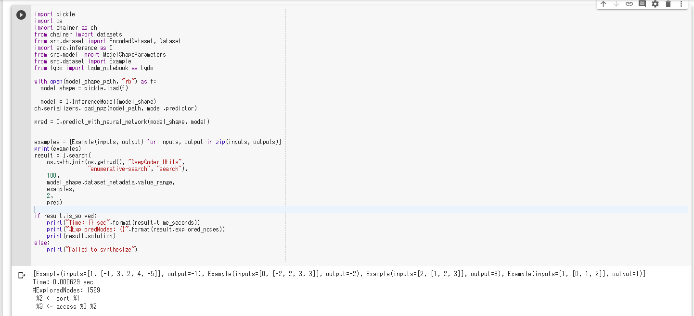

deep-coder
===

This repository is a re-implementation of [DeepCoder](https://openreview.net/pdf?id=ByldLrqlx). DeepCoder can synthesize domain-specific programs from inputs/output examples.


Notice (Sep/1/2019)
---

I rewrite the implementation from scratch. The previous implementation is in the [v0.0.0 tag](https://github.com/HiroakiMikami/deep-coder/tree/v0.0.0).


Requirements
---

### Colab

* Google account

### Local Runtime

* Linux (I think the code works in macOSes, but I have not tested the code in a macOS)
* Python3 (`Python)
* `make`
* `g++`


Usage
---

_*Warning*_
*The notebook in the `examples` directory will use Google Drive as data storage. Please be careful not to overwrite your data!*

### Quickstart

`inference.ipynb` synthesizes the domain-specific language using pre-training model (`examples/medium/trained-model`). 




### Training

#### 1. Setup (if you use local runtimes)

```bash
# Download this repository and DeepCoder-Utils
$ git clone https://github.com/HiroakiMikami/deep-coder
$ cd deep-coder
$ git submodule init
$ git submodule update
# Build the search tool
$ make -C DeepCoder_Utils/enumerative-search -j $(nproc)
# Install python modules
$ pip install -r requirements.txt
# Setup Jupyter notebooks to use local runtimes of Colab
$ ./bin/init.bash
```

#### 2. Training

The notebooks in `examples/medium` directory show how to train DeepCoder.
Training consists of the following steps:

1. generate the dataset (`examples/medium/generate_dataset.ipynb`)
    * It may take more than 1 hour in Colab.
    * In the above example, I used [a local runtime](https://research.google.com/colaboratory/local-runtimes.html) then uploaded the dataset file to the Google Drive (`DeepCoder/dataset/length_3`).
2. generate the baseline result (`examples/medium/generate_baseline_results.ipynb`)
3. train the DNN model by using the training dataset and validate the model (`examples/medium/train.ipynb`)
4. compare the results of the DNN model with the baseline (`examples/medium/comparison_with_baseline.ipynb`)

### Run unit tests

```bash
$ python -m unittest discover test
```


Result
---

### Small Scale Experiment

`examples/small/integer_embeddings.ipynb` shows the learned embedding of integers. The embedding was trained by using the dataset with length=1 programs and `E=2` model.

It does not show the clear trend shown in Figure 8 in the [paper](https://openreview.net/pdf?id=ByldLrqlx).
There are many possible causes (e.g., the procedure of dataset generation, training hyperparameters) and I don't know what the root cause of this difference is.

### Medium Scale Experiment (Smaller-scale experiment in the paper)

|Timeout needed to solve                                                  |20%  |40%  |60%  |
|:---                                                                     |:--- |:--- |:--- |
|Baseline                                                                 |53ms |122ms|375ms|
|DeepCoder                                                                |5ms  |24ms |87ms |
|Speedup (this implementation)                                            |10.8x|5.0x |3.6x |
|Speedup (Table 1 in the [paper](https://openreview.net/pdf?id=ByldLrqlx))|62.2x|54.6x|31.5x|

The trained model speeds up the program synthesize. However, the performance of this implementation is worse than which of the paper. I think the reason for this difference is the same as the reason for the integer-embedding difference, but there is no basis.

The details of the results is in `examples/medium/comparison_with_baseline.ipynb`.


### Loss Function

The binary attribute that is predicted by DNN is heavily imbalanced because each program in the dataset contains only 1-3 functions. For example, the attribute of `a <- int | b <- [int] | c <- TAKE a b` contains 33 `False` and only 1 `True`.

I doubted that this imbalance decreases the performance of the DNN model, and introduced cost-sensitive loss function (`weighted_sigmoid_cross_entropy` in `src/model.py`).

However, I cannot see the performance improvement in the medium scale experiment. `examples/medium/loss_function_comparison.ipynb` shows the results of the training using the cost-sensitive loss function. `examples/medium/train_w0_{0.25|0.5|0.75}.ipynb` shows the training logs.


Todos
---

* [ ] Investigate the difference from the original paper
* [ ] Run the large scale experiment (train with the program length of `4` dataset)
